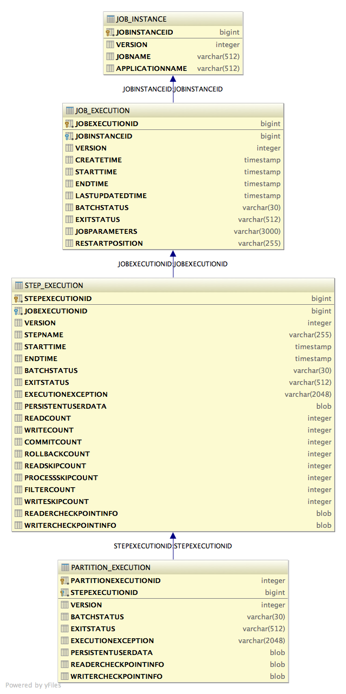

# Set up JBeret

## Maven Repositories
All JBeret artifacts are available in eitehr [Maven Central](http://search.maven.org/#search%7Cga%7C1%7Cjberet) or [jboss.org repository](https://repository.jboss.org/nexus/index.html). To use jboss.org repository, add the following to pom.xml:

```xml
<repositories>
        <repository>
            <id>jboss-public-repository-group</id>
            <name>JBoss Public Repository Group</name>
            <url>http://repository.jboss.org/nexus/content/groups/public/</url>
        </repository>
    </repositories>
```

## JBeret Artifacts
JBeret project produces the following major artifacts:
### jberet-core
contains all classes of JBeret batch runtime. This library is required to run batch applications in both Java SE and Java EE environment.
### jberet-se
contains implementation classes of JBeret batch runtime specifically for Java SE environment.
### jberet-distribution
a zip file containing the following content, and provides a good start to write and run batch applications with JBeret in Java SE.

* all libraries required to run batch applications in Java SE environment
* default configuration file, `jberet.properties` for configuring JBeret batch runtime in Java SE environment
* jberet-support library and its common transitive dependencies

### jberet-support
contains built-in batch artifacts (e.g., `ItemReader`, `ItemWriter`, `Batchlet` classes) for handling common data types and tasks. This library can be optionally referenced by batch applications to simplify development. The application should make sure to satisfy appropriate transitive dependencies originating from jberet-support, depending on its usage. Subsequent chapters in this guide and [JBeret javadocs](http://docs.jboss.org/jberet/) contain details how to use these built-in batch artifacts.

##Batch application dependencies
###Minimal application dependencies:
```xml
<dependency>
    <groupId>org.jboss.spec.javax.batch</groupId>
    <artifactId>jboss-batch-api_1.0_spec</artifactId>
</dependency>
<dependency>
    <groupId>javax.inject</groupId>
    <artifactId>javax.inject</artifactId>
</dependency>
<dependency>
    <groupId>javax.enterprise</groupId>
    <artifactId>cdi-api</artifactId>
</dependency>
<dependency>
    <groupId>org.jboss.spec.javax.transaction</groupId>
    <artifactId>jboss-transaction-api_1.2_spec</artifactId>
</dependency>
<dependency>
    <groupId>org.jberet</groupId>
    <artifactId>jberet-core</artifactId>
</dependency>
<dependency>
    <groupId>org.jboss.marshalling</groupId>
    <artifactId>jboss-marshalling</artifactId>
</dependency>
<dependency>
    <groupId>org.jboss.logging</groupId>
    <artifactId>jboss-logging</artifactId>
</dependency>
<dependency>
    <groupId>org.jboss.weld</groupId>
    <artifactId>weld-core</artifactId>
</dependency>
<dependency>
    <groupId>org.wildfly.security</groupId>
    <artifactId>wildfly-security-manager</artifactId>
</dependency>
<dependency>
    <groupId>com.google.guava</groupId>
    <artifactId>guava</artifactId>
</dependency>
```
A note on webapp or Java EE application packaging: Java EE API jars (batch-api, cdi-api, javax.inject, transaction-api)
are already available in the appserver, and should not be included in WAR, JAR, or EAR files. Their maven dependency
scope should be set to `provided`. In addition, if the application is deployed to JBoss EAP or WildFly, almost all of the above dependencies are already available as JBoss modules, and should not be duplicated in application package.

###Additional dependencies for Java SE batch applications
h2 can be omitted when using in-memory batch job repository:
```xml
<dependency>
    <groupId>org.jberet</groupId>
    <artifactId>jberet-se</artifactId>
</dependency>
<dependency>
    <groupId>org.jboss.weld.se</groupId>
    <artifactId>weld-se</artifactId>
</dependency>
<dependency>
    <groupId>com.h2database</groupId>
    <artifactId>h2</artifactId>
</dependency>
```
###Optional application dependencies:
```xml
<!-- any JDBC driver jars, e.g, h2, when using jdbc batch job repository -->
<dependency>
    <groupId>com.h2database</groupId>
    <artifactId>h2</artifactId>
</dependency>

<!-- infinispan and jgroups jars, when infinispan job repository is
used. Additional infinispan cachestore jars (e.g.,
infinispan-cachestore-jdbc, infinispan-cachestore-mongodb,
infinispan-cachestore-leveldb, infinispan-cachestore-rest,
infinispan-cachestore-cassandra, etc) may be needed if such a
cachestore is used. -->
 <dependency>
     <groupId>org.infinispan</groupId>
     <artifactId>infinispan-core</artifactId>
 </dependency>
 <dependency>
     <groupId>org.infinispan</groupId>
     <artifactId>infinispan-commons</artifactId>
 </dependency>
 <dependency>
     <groupId>org.jgroups</groupId>
     <artifactId>jgroups</artifactId>
 </dependency>

 <!-- MongoDB jars, when MongoDB job repository is used -->
 <dependency>
     <groupId>org.mongodb</groupId>
     <artifactId>mongo-java-driver</artifactId>
 </dependency>

<!-- For Weld 2.2.2.Final or later, Jandex is required -->
<dependency>
    <groupId>org.jboss</groupId>
    <artifactId>jandex</artifactId>
</dependency>

<!-- You can choose to replace Java built-in StAX provider with
     aalto-xml or woodstox (woodstox dependencies not shown here)
-->
<dependency>
    <groupId>com.fasterxml</groupId>
    <artifactId>aalto-xml</artifactId>
</dependency>
<dependency>
    <groupId>org.codehaus.woodstox</groupId>
    <artifactId>stax2-api</artifactId>
</dependency>

<!-- jberet-support includes common reusable batch ItemReader &
ItemWriter classes for various data formats such as CSV, XML,
JSON, Fixed length, Excel, MongoDB, JDBC, JMS, HornetQ, PDF, etc.
The application should further provide appropriate transitive
dependencies from jberet-support, depending on its usage.
-->
<dependency>
    <groupId>org.jberet</groupId>
    <artifactId>jberet-support</artifactId>
</dependency>
```

##Configure JBeret Batch Runtime
###Configure Batch Subsystem in JBoss EAP or WildFly
jberet-core module is included in JBoss EAP and WildFly application server as batch processing subsystem. Its configuration data is kept in EAP or WildFly server configuration file (e.g., `standalone.xml` or `domain.xml`), and can be viewed or edited through CLI or Admin Console. See EAP or WildFly administration guide for more details.

The following is a sample batch subsystem configuration that uses:
* `in-memory` job repository, which is also the default batch job repository type;
* a `thread-pool` with `max-threads` `count` of `10`, and each thread has `keepalive-time` of `30` seconds.

```xml
<subsystem xmlns="urn:jboss:domain:batch:1.0">
    <job-repository>
        <in-memory/>
    </job-repository>
    <thread-pool>
        <max-threads count="10"/>
        <keepalive-time time="30" unit="seconds"/>
    </thread-pool>
</subsystem>

```

###Configure JBeret in Java SE
When running standalone JBeret in Java SE environment, it is configured through `jberet.properties` file. If this file is not present in the application classpath, various defaults will apply as explained in next sections.

####5 Types of JBeret Job Repository
Currently 4 types of job repository are supported:
* **`in-memory`**: Batch job data is kept in-memory and will disappear when the JVM exits. `in-memory` job repository will be used if `jberet.properties` is not present, or `job-repository-type` is set to `in-memory` in `jberet-properties`.

* **`jdbc`**: batch job data is saved to a relational database through JDBC. In JBeret standalone Java SE distribution, `job-repository-type` is set to `jdbc` in `jberet.properties`. JBeret contains JDBC DDL scripts for the following common database products, and other unlisted RDBMS can also be supported if appropriate DDL script is provided:
    * h2 (default database product)
    * oracle
    * mssqlserver
    * mysql
    * postgresql
    * db2
    * sybase
    * derby
    * hsqldb
    * firebird

* **`mongodb`**: batch job data is saved to MongoDB NoSQL data store. With `mongodb` job repository, `db-url` property can be configured to include all MongoDB connection information.
* **`infinispan`**: batch job data is saved to Infinispan or Red Hat JDG cache. With `infinispan` job repository, `infinispan-xml` property specifies the resource path to the configuration XML for infinispan job repository. Infinispan job repository can be in-memory or backed by various cache stores supported by the underlying Infinispan or JDG product, such as file-system cache store, JDBC cache store, or LevelDB cache store.

####Configure JDBC Job Repository
For `jdbc` job repository, the following 5 properties may be specified in `jberet.properties`:

* `db-url`: connection URL, which may also include credentials and connection properties.
* `db-user`: database user name
* `db-password`: database password for the above user name
* `db-properties`: additional connection properties, key-value pairs separated by comma
* `ddl-file`: (uncommon) file path or resource path for custom DDL script

The following is a sample `jberet.properties` file that demonstrates the use of job repository properties:

```sh
# Optional, valid values are jdbc (default), mongodb and in-memory
job-repository-type = jdbc

# Optional, default is jdbc:h2:~/jberet-repo for h2 database as the default job repository DBMS.
# For h2 in-memory database, db-url = jdbc:h2:mem:test;DB_CLOSE_DELAY=-1
# For mongodb, db-url includes all the parameters for MongoClientURI, including hosts, ports, username, password,
# database name, and options.  The format of MongoClient uri:
#    mongodb://[username:password@]host1[:port1][,host2[:port2],...[,hostN[:portN]]][/[database][?options]]
# See MongoClientURI javadoc at http://api.mongodb.org/java/current/
# An example of MongoDB db-url = mongodb://localhost/testData
db-url = jdbc:h2:~/jberet-repo
db-user =
db-password =
db-properties =

# Optional, ddl-file specifies the location of job repository ddl file resource, loadable by jberet class loader.
# Typically this property is not needed. jberet uses one of the ddl files included in jberet-core-<version>.jar,
# depending on the database product. If no matching ddl-file is available, it defaults to sql/jberet.ddl. This
# property can be specified to override the built-in ddl-file resources.
# ddl-file =

## To use a different DBMS, specify db-related properties.
## Non-default JDBC driver jars should also be included in classpath.

# oracle
# db-url = jdbc:oracle:thin:@localhost:1521:qaora12

# mssqlserver
# db-url = jdbc:sqlserver://localhost:1433;DatabaseName=jbossqa

# mysql
# db-url = jdbc:mysql://localhost:3306/test
# db-user = root
# db-password =

# postgresql
# db-url = jdbc:postgresql://localhost:5432/postgres
# db-user = postgres
# db-password =

# db2
# db-url = jdbc:db2://localhost:50000/jbossqa

# sybase
# db-url = jdbc:sybase:Tds:localhost:5000/jbossqa

# derby network server or derby embedded:
# db-url = jdbc:derby://localhost:1527/derbyDB;create=true
# db-url = jdbc:derby:derbyDB;create=true

# hsqldb in-memory or file-based
# db-url = jdbc:hsqldb:mem:test;DB_CLOSE_DELAY=-1
# db-url = jdbc:hsqldb:file:~/jberet-hsqldb

# firebird
# db-url = jdbc:firebirdsql:localhost/3050:/tmp/my.fdb
# db-user = sysdba
# db-password = masterkey
```

####JDBC Job Repository Database Schema
JDBC job repository consists of 4 tables:
* `JOB_INSTANCE`
* `JOB_EXECUTION`
* `STEP_EXECUTION`
* `PARTITION_EXECUTION`



If a custom DDL file is needed, it should define the same tables, and separate each table definition with "!!". The following is the default `jberet.ddl` included in `jberet-core` module:

```sql
/*
 Default DDL file, using h2 database for job repository.
 */

CREATE TABLE IF NOT EXISTS JOB_INSTANCE
(
  JOBINSTANCEID   IDENTITY PRIMARY KEY NOT NULL,
  VERSION         INTEGER,
  JOBNAME         VARCHAR(512),
  APPLICATIONNAME VARCHAR(512)
)!!
CREATE TABLE IF NOT EXISTS JOB_EXECUTION
(
  JOBEXECUTIONID  IDENTITY PRIMARY KEY NOT NULL,
  JOBINSTANCEID   BIGINT             NOT NULL,
  VERSION         INTEGER,
  CREATETIME      TIMESTAMP,
  STARTTIME       TIMESTAMP,
  ENDTIME         TIMESTAMP,
  LASTUPDATEDTIME TIMESTAMP,
  BATCHSTATUS     VARCHAR(30),
  EXITSTATUS      VARCHAR(512),
  JOBPARAMETERS   VARCHAR(3000),
  RESTARTPOSITION VARCHAR(255),
  FOREIGN KEY (JOBINSTANCEID) REFERENCES JOB_INSTANCE (JOBINSTANCEID)
)!!
CREATE TABLE IF NOT EXISTS STEP_EXECUTION
(
  STEPEXECUTIONID    IDENTITY PRIMARY KEY NOT NULL,
  JOBEXECUTIONID     BIGINT             NOT NULL,
  VERSION            INTEGER,
  STEPNAME           VARCHAR(255),
  STARTTIME          TIMESTAMP,
  ENDTIME            TIMESTAMP,
  BATCHSTATUS        VARCHAR(30),
  EXITSTATUS         VARCHAR(512),
  EXECUTIONEXCEPTION VARCHAR(2048),
  PERSISTENTUSERDATA BLOB,
  READCOUNT          INTEGER,
  WRITECOUNT         INTEGER,
  COMMITCOUNT        INTEGER,
  ROLLBACKCOUNT      INTEGER,
  READSKIPCOUNT      INTEGER,
  PROCESSSKIPCOUNT   INTEGER,
  FILTERCOUNT        INTEGER,
  WRITESKIPCOUNT     INTEGER,
  READERCHECKPOINTINFO  BLOB,
  WRITERCHECKPOINTINFO  BLOB,
  FOREIGN KEY (JOBEXECUTIONID) REFERENCES JOB_EXECUTION (JOBEXECUTIONID)
)!!
CREATE TABLE IF NOT EXISTS PARTITION_EXECUTION
(
  PARTITIONEXECUTIONID  INTEGER NOT NULL,
  STEPEXECUTIONID       BIGINT  NOT NULL,
  VERSION               INTEGER,
  BATCHSTATUS           VARCHAR(30),
  EXITSTATUS            VARCHAR(512),
  EXECUTIONEXCEPTION    VARCHAR(2048),
  PERSISTENTUSERDATA    BLOB,
  READERCHECKPOINTINFO  BLOB,
  WRITERCHECKPOINTINFO  BLOB,
  PRIMARY KEY (PARTITIONEXECUTIONID, STEPEXECUTIONID),
  FOREIGN KEY (STEPEXECUTIONID) REFERENCES STEP_EXECUTION (STEPEXECUTIONID)
)!!
```

####Configure Infinispan Job Repository in Java SE
`infinispan-xml` property specifies the resource path to the configuration XML for infinispan job repository, and it defaults to `infinispan.xml`. See infinispan or JDG documentation for details how to configure infinispan or JDG. The following are some examples of infinispan XML configuration for various cache stores:

```xml
<?xml version="1.0" encoding="UTF-8"?>

<!-- the default infinispan.xml with file-system cache store
    bundled in JBeret Java SE distribution
-->

<infinispan xmlns="urn:infinispan:config:7.0" xmlns:xsi="http://www.w3.org/2001/XMLSchema-instance"
            xsi:schemaLocation="urn:infinispan:config:7.0 http://infinispan.org/schemas/infinispan-config-7.0.xsd">

    <cache-container name="jberet" default-cache="JOB_EXECUTION">
        <transport lock-timeout="60000"/>

        <distributed-cache name="JOB_INSTANCE" mode="ASYNC" l1-lifespan="0">
            <persistence>
                <file-store path="jberet.infinispan.file.store"/>
            </persistence>
        </distributed-cache>

        <distributed-cache name="JOB_EXECUTION" mode="ASYNC" l1-lifespan="0">
            <persistence>
                <file-store path="jberet.infinispan.file.store"/>
            </persistence>
        </distributed-cache>

        <distributed-cache name="STEP_EXECUTION" mode="ASYNC" l1-lifespan="0">
            <persistence>
                <file-store path="jberet.infinispan.file.store"/>
            </persistence>
        </distributed-cache>

        <distributed-cache name="PARTITION_EXECUTION" mode="ASYNC" l1-lifespan="0">
            <persistence>
                <file-store path="jberet.infinispan.file.store"/>
            </persistence>
        </distributed-cache>

        <distributed-cache name="seq" mode="SYNC" l1-lifespan="0">
            <transaction mode="BATCH" locking="PESSIMISTIC"/>
            <persistence>
                <file-store preload="true" fetch-state="true" path="jberet.infinispan.file.store"/>
            </persistence>
        </distributed-cache>
    </cache-container>
</infinispan>

```

```xml
<?xml version="1.0" encoding="UTF-8"?>

<!-- in-memory infinispan example -->

<infinispan xmlns="urn:infinispan:config:7.0" xmlns:xsi="http://www.w3.org/2001/XMLSchema-instance"
            xsi:schemaLocation="urn:infinispan:config:7.0 http://infinispan.org/schemas/infinispan-config-7.0.xsd">

    <cache-container name="jberet" default-cache="JOB_EXECUTION">
        <transport lock-timeout="60000"/>

        <distributed-cache name="JOB_INSTANCE" mode="ASYNC" l1-lifespan="0">
        </distributed-cache>

        <distributed-cache name="JOB_EXECUTION" mode="ASYNC" l1-lifespan="0">
        </distributed-cache>

        <distributed-cache name="STEP_EXECUTION" mode="ASYNC" l1-lifespan="0">
        </distributed-cache>

        <distributed-cache name="PARTITION_EXECUTION" mode="ASYNC" l1-lifespan="0">
        </distributed-cache>

        <distributed-cache name="seq" mode="SYNC" l1-lifespan="0">
            <transaction mode="BATCH" locking="PESSIMISTIC"/>
        </distributed-cache>
    </cache-container>
</infinispan>

```

```xml
<?xml version="1.0" encoding="UTF-8"?>

<!-- infinispan with LevelDB cache store example -->

<infinispan xmlns="urn:infinispan:config:7.0" xmlns:xsi="http://www.w3.org/2001/XMLSchema-instance"
            xsi:schemaLocation="urn:infinispan:config:7.0 http://infinispan.org/schemas/infinispan-config-7.0.xsd">

    <cache-container name="jberet" default-cache="JOB_EXECUTION">
        <transport lock-timeout="60000"/>

        <distributed-cache name="JOB_INSTANCE" mode="ASYNC" l1-lifespan="0">
            <persistence>
                <store class="org.infinispan.persistence.leveldb.LevelDBStore">
                    <property name="location">/tmp/jberet.infinispan.leveldb.location/JOB_INSTANCE</property>
                    <property name="expiredLocation">/tmp/jberet.infinispan.leveldb.expiredLocation/JOB_INSTANCE</property>
                    <property name="implementationType">JAVA</property>
                </store>
            </persistence>
        </distributed-cache>

        <distributed-cache name="JOB_EXECUTION" mode="ASYNC" l1-lifespan="0">
            <persistence>
                <store class="org.infinispan.persistence.leveldb.LevelDBStore">
                    <property name="location">/tmp/jberet.infinispan.leveldb.location/JOB_EXECUTION</property>
                    <property name="expiredLocation">/tmp/jberet.infinispan.leveldb.expiredLocation/JOB_EXECUTION</property>
                    <property name="implementationType">JAVA</property>
                </store>
            </persistence>
        </distributed-cache>

        <distributed-cache name="STEP_EXECUTION" mode="ASYNC" l1-lifespan="0">
            <persistence>
                <store class="org.infinispan.persistence.leveldb.LevelDBStore">
                    <property name="location">/tmp/jberet.infinispan.leveldb.location/STEP_EXECUTION</property>
                    <property name="expiredLocation">/tmp/jberet.infinispan.leveldb.expiredLocation/STEP_EXECUTION</property>
                    <property name="implementationType">JAVA</property>
                </store>
            </persistence>
        </distributed-cache>

        <distributed-cache name="PARTITION_EXECUTION" mode="ASYNC" l1-lifespan="0">
            <persistence>
                <store class="org.infinispan.persistence.leveldb.LevelDBStore">
                    <property name="location">/tmp/jberet.infinispan.leveldb.location/PARTITION_EXECUTION</property>
                    <property name="expiredLocation">/tmp/jberet.infinispan.leveldb.expiredLocation/PARTITION_EXECUTION</property>
                    <property name="implementationType">JAVA</property>
                </store>
            </persistence>
        </distributed-cache>

        <distributed-cache name="seq" mode="SYNC" l1-lifespan="0">
            <transaction mode="BATCH" locking="PESSIMISTIC"/>
            <persistence>
                <store class="org.infinispan.persistence.leveldb.LevelDBStore" preload="true" fetch-state="true">
                    <property name="location">/tmp/jberet.infinispan.leveldb.location/seq</property>
                    <property name="expiredLocation">/tmp/jberet.infinispan.leveldb.expiredLocation/seq</property>
                    <property name="implementationType">JAVA</property>
                </store>
            </persistence>
        </distributed-cache>
    </cache-container>
</infinispan>

```

```xml
<?xml version="1.0" encoding="UTF-8"?>

<!-- infinispan with JDBC cache store example (H2 Database) -->

<infinispan xmlns="urn:infinispan:config:7.0" xmlns:xsi="http://www.w3.org/2001/XMLSchema-instance"
            xsi:schemaLocation="urn:infinispan:config:7.0 http://infinispan.org/schemas/infinispan-config-7.0.xsd">

    <cache-container name="jberet" default-cache="JOB_EXECUTION">
        <transport lock-timeout="60000"/>

        <distributed-cache name="JOB_INSTANCE" mode="ASYNC" l1-lifespan="0">
            <persistence>
                <string-keyed-jdbc-store xmlns="urn:infinispan:config:store:jdbc:7.0"
                                         fetch-state="false" read-only="false" purge="false">
                    <connection-pool connection-url="jdbc:h2:mem:infinispan_string_based;DB_CLOSE_DELAY=-1"
                                     username="sa" driver="org.h2.Driver"/>
                    <string-keyed-table drop-on-exit="false" create-on-start="true" prefix="JBERET_ISPN">
                        <id-column name="ID_COLUMN" type="VARCHAR(255)"/>
                        <data-column name="DATA_COLUMN" type="BINARY"/>
                        <timestamp-column name="TIMESTAMP_COLUMN" type="BIGINT"/>
                    </string-keyed-table>
                </string-keyed-jdbc-store>
            </persistence>
        </distributed-cache>

        <distributed-cache name="JOB_EXECUTION" mode="ASYNC" l1-lifespan="0">
            <persistence>
                <string-keyed-jdbc-store xmlns="urn:infinispan:config:store:jdbc:7.0"
                                         fetch-state="false" read-only="false" purge="false">
                    <connection-pool connection-url="jdbc:h2:mem:infinispan_string_based;DB_CLOSE_DELAY=-1"
                                     username="sa" driver="org.h2.Driver"/>
                    <string-keyed-table drop-on-exit="false" create-on-start="true" prefix="JBERET_ISPN">
                        <id-column name="ID_COLUMN" type="VARCHAR(255)"/>
                        <data-column name="DATA_COLUMN" type="BINARY"/>
                        <timestamp-column name="TIMESTAMP_COLUMN" type="BIGINT"/>
                    </string-keyed-table>
                </string-keyed-jdbc-store>
            </persistence>
        </distributed-cache>

        <distributed-cache name="STEP_EXECUTION" mode="ASYNC" l1-lifespan="0">
            <persistence>
                <string-keyed-jdbc-store xmlns="urn:infinispan:config:store:jdbc:7.0"
                                         fetch-state="false" read-only="false" purge="false">
                    <connection-pool connection-url="jdbc:h2:mem:infinispan_string_based;DB_CLOSE_DELAY=-1"
                                     username="sa" driver="org.h2.Driver"/>
                    <string-keyed-table drop-on-exit="false" create-on-start="true" prefix="JBERET_ISPN">
                        <id-column name="ID_COLUMN" type="VARCHAR(255)"/>
                        <data-column name="DATA_COLUMN" type="BINARY"/>
                        <timestamp-column name="TIMESTAMP_COLUMN" type="BIGINT"/>
                    </string-keyed-table>
                </string-keyed-jdbc-store>
            </persistence>
        </distributed-cache>

        <distributed-cache name="PARTITION_EXECUTION" mode="ASYNC" l1-lifespan="0">
            <persistence>
                <string-keyed-jdbc-store xmlns="urn:infinispan:config:store:jdbc:7.0"
                                         fetch-state="false" read-only="false" purge="false">
                    <connection-pool connection-url="jdbc:h2:mem:infinispan_string_based;DB_CLOSE_DELAY=-1"
                                     username="sa" driver="org.h2.Driver"/>
                    <string-keyed-table drop-on-exit="false" create-on-start="true" prefix="JBERET_ISPN">
                        <id-column name="ID_COLUMN" type="VARCHAR(255)"/>
                        <data-column name="DATA_COLUMN" type="BINARY"/>
                        <timestamp-column name="TIMESTAMP_COLUMN" type="BIGINT"/>
                    </string-keyed-table>
                </string-keyed-jdbc-store>
            </persistence>
        </distributed-cache>

        <distributed-cache name="seq" mode="SYNC" l1-lifespan="0">
            <transaction mode="BATCH" locking="PESSIMISTIC"/>
            <persistence>
                <string-keyed-jdbc-store xmlns="urn:infinispan:config:store:jdbc:7.0"
                                         fetch-state="false" read-only="false" purge="false">
                    <connection-pool connection-url="jdbc:h2:mem:infinispan_string_based;DB_CLOSE_DELAY=-1"
                                     username="sa" driver="org.h2.Driver"/>
                    <string-keyed-table drop-on-exit="false" create-on-start="true" prefix="JBERET_ISPN">
                        <id-column name="ID_COLUMN" type="VARCHAR(255)"/>
                        <data-column name="DATA_COLUMN" type="BINARY"/>
                        <timestamp-column name="TIMESTAMP_COLUMN" type="BIGINT"/>
                    </string-keyed-table>
                </string-keyed-jdbc-store>
            </persistence>
        </distributed-cache>
    </cache-container>
</infinispan>

```

The following additional dependencies are needed for infinispan job repository with LevelDB cache store:

```xml
<dependency>
    <groupId>org.infinispan</groupId>
    <artifactId>infinispan-cachestore-leveldb</artifactId>
    <version>${version.org.infinispan}</version>
</dependency>

<!-- Java impl of LevelDB -->
<dependency>
    <groupId>org.iq80.leveldb</groupId>
    <artifactId>leveldb</artifactId>
    <version>0.7</version>
</dependency>
```

The following additional dependencies are needed for infinispan job repository with JDBC cache store:

```xml
<dependency>
    <groupId>org.infinispan</groupId>
    <artifactId>infinispan-cachestore-jdbc</artifactId>
    <version>${version.org.infinispan}</version>
</dependency>

<!-- Jdbc connection pool and datasource impl used by infinispan-cachestore-jdbc -->
<dependency>
    <groupId>com.mchange</groupId>
    <artifactId>c3p0</artifactId>
    <version>0.9.5-pre10</version>
</dependency>

<!-- the underlying database client jars, such as H2 Database -->
<dependency>
    <groupId>com.h2database</groupId>
    <artifactId>h2</artifactId>
</dependency>
```

####Configure JBeret Thread Pool in Java SE
JBeret invokes `java.util.concurrent` API to concurrently execute jobs and job elements such as steps, flows, and splits. `jberet.properties` contains various properties for modifying JBeret execution concurrency. The following is snippet from `jberet.properties` that demonstrate the use of concurrency-related properties:

```sh
## All thread-related properties are optional. Some properties may not apply to certain types of thread-pool and may be
## ignored. For more details, please see http://docs.oracle.com/javase/7/docs/api/java/util/concurrent/ThreadPoolExecutor.html

# Valid values are Cached, Fixed, Configured, and the default is Cached.
# Cached: java.util.concurrent.Executors.newCachedThreadPool method is invoked to create executor.
#         thread-factory property may be specified and all other thread-related properties are ignored.
#
# Fixed: java.util.concurrent.Executors.newFixedThreadPool method is invoked to create executor.
#        thread-factory and thread-pool-core-size properties may be specified and all other thread-related properties
#        are ignored.
#
# Configured: java.util.concurrent.ThreadPoolExecutor is created with thread-related properties as parameters.
thread-pool-type =

# New tasks are serviced first by creating core threads.
# Required for Configured type.
thread-pool-core-size =

# If all core threads are busy, new tasks are queued.
# int number indicating the size of the work queue. If 0 or negative, a java.util.concurrent.SynchronousQueue is used.
# Required for Configured type.
thread-pool-queue-capacity =

# If queue is full, additional non-core threads are created to service new tasks.
# int indicating the maximum size of the thread pool.
# Required for Configured type.
thread-pool-max-size =

# long number indicating the number of seconds a thread can stay idle.
# Required for Configured type.
thread-pool-keep-alive-time =

# Optional, valid values are true and false, defaults to false.
thread-pool-allow-core-thread-timeout =

# Optional, valid values are true and false, defaults to false.
thread-pool-prestart-all-core-threads =

# Optional, fully-qualified name of a class that implements java.util.concurrent.ThreadFactory.
# This property should not be needed in most cases.
thread-factory =

# Optional, fully-qualified name of a class that implements java.util.concurrent.RejectedExecutionHandler.
# This property should not be needed in most cases.
thread-pool-rejection-policy =
```


